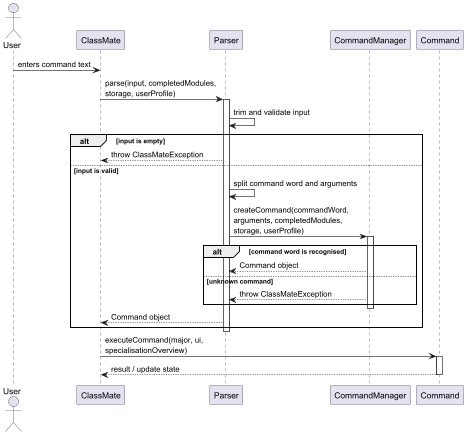
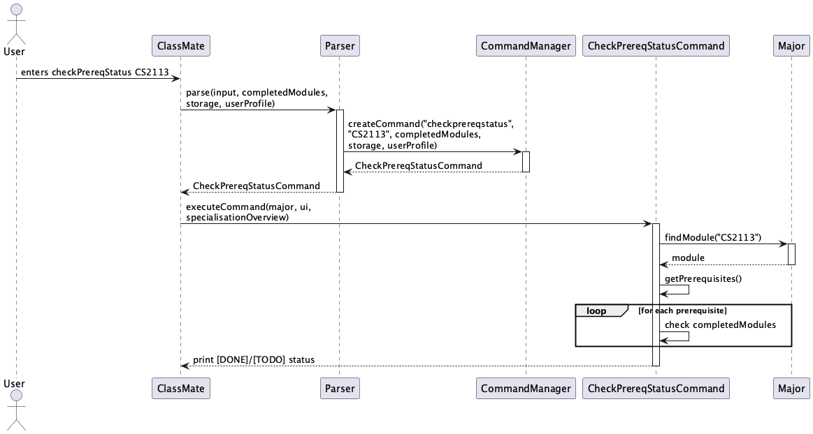

## **Acknowledgements**
This project was built from scratch by the W11-4 team. The command structure was inspired by the AddressBook-Level3 project by SE-EDU (https://se-education.org). No third-party libraries were used beyond the Java standard library and JUnit 5 for testing.

## **Setup and Getting started**
Refer to the guide [_Getting started_](link).


## **Design**
### Architecture
ClassMate follows a simple component-based architecture. Each component has a clear responsibility and communicates through well-defined interfaces.

The architecture of ClassMate is kept simple as all components reside in a single package. The main components are described in the Components section below.

### Components:
* `ClassMate`: Initialises other components and houses the `main` execution loop.
* `Parser`: Decompose raw user input strings into a command word and arguments, then delegating the creation of a `Command` object.
* `Command`: An abstract base class for all instructions (e.g., `viewGradReqsCommand`, `ByeCommand`). Each subclass encapsulates the specific behavior of a user action and signals back to `ClassMate` if the app should terminate via the `isExit` flag.
* `Ui`: Handles all interactions with the user. It is the only class that contains `System.out.println` calls, ensuring a consistent look and feel across the application.
* `UserProfile`: Holds the state of the user’s academic progress, including their specialisation and modules taken.
* `ModulesLoader`: Loads the module information for major and specialisation modules to be used.
* `Storage`: Responsible for reading from and writing data to the hard disk, ensuring user data is saved between sessions. 

### Interaction between architecture components:
The ***Sequence Diagram*** shows how the components interact with each other for the scenario when the user issues the command `viewPrereqs`

```
User      ClassMate    Parser   CommandManager  PrereqCommand  Major  SpecOvw
 |            |           |            |              |           |      |
 |--viewPrereqs CS2113---->           |              |           |      |
 |            |--parse(input)-------->|              |           |      |
 |            |           |--createCommand()-------->|           |      |
 |            |           |            |<--PrereqCmd-------------|      |
 |            |--executeCommand(...)---------------->|           |      |
 |            |           |            |             |--findModule(code)>|
 |            |           |            |             |<--module----------|  [if null: also checks SpecOvw]
 |            |           |            |             |--printPrereqTree(major)
 |            |           |            |             |<--tree string-----|
 |<--prints prereq tree---|            |             |           |      |
```
1. The user enters the command `viewPrereqs CS2113`.
2. 'ClassMate' receives the input and passes it to the parser.
3. The parser interprets the command word and creates the corresponding command object.
4. 'ClassMate' executes the command object.
5. The command looks up the requested module in the main module data.
6. If the module is not found there, the command checks the specialisation overview module data.
7. Once the module is found, the command generates the prerequisite tree using the module data.
8. The final prerequisite tree is returned and displayed to the user through the UI.

#### Design considerations
- The command pattern is used to ensure user action is encapsulated in its own command class, keeping command-specific logic separate from input parsing and applicationc ontrol flow.
- The UI is responsible only for presentation. It does not participate in the generation of the prerequisite tree.
- The module lookup is separated from output formatting, making the feature easier to maintain and extend.
- If the requested module cannot be found, the command should report an error instead of generating the prerequisite tree.

### UI Component
The UI component is responsible for displaying all user-facing text output in ClassMate to the user.
It displays the welcome message, help information, error messages, exit message, and formatted results for feature commands.

The UI acts purely as a presentation layer and contains no application logic.
It ensures that all output is displayed in a consistent and readable format.
This design follows the Single Responsibility Principle and makes the application easier to maintain. 
Changes to wording, formatting, or layout can be made in one place without affecting the rest of the system.

### Parser and CommandManager Component
The 'Parser' and 'CommandManager' components jointly form the command-processing layer of ClassMate.
'Parser' decomposes the raw user input into a command word and arguments, while the 'CommandManager' instantiates the corresponding command object.

This design keeps command recognition separate from command execution. Each command is represented by its own class, allowing the application to be modular and easier to extend.
The components also centralise error handling for invalid commands. Empty commands and unrecognised command words are rejected early, ensuring that only valid command objects are passed on for execution.

This sequence diagram illustrates how ClassMate processes a user command from raw input to an executable command object.

1. The user enters a command in the command line interface (CLI).
2. 'ClassMate' passed the raw input to 'Parser'.
3. 'Parser' trims the input and checks whether it is empty.
   - If the input is empty, a 'ClassMateException' is thrown immediately.
4. If the input is valid, 'Parser' extracts the command word and arguments.
5. 'Parser' passes the command word and arguments to 'CommandManager'.
6. 'CommandManager' creates the corresponding command object for the recognised command word.
   - If the command word is unrecognised, a 'ClassMateException' is thrown.
7. The created command object is returned to 'ClassMate'.
8. 'ClassMate' executes the command using the common command interface.
9. The command performs its action and may update application state or display results.

#### Design considerations
- The 'Parser' is responsible only for preprocessing and validation of raw input.
- The 'CommandManager' centralises command creation, ensuring command selection logic is kept in one place.
- Each concrete command encapsulates its own behavior, ensuring the system is modular and easy to extend.
- Error handling is performed early so invalid input does not propagate further into the application.


## **Implementation of Features**

### **Viewing Module Information**

<Uses `Parser`, `ViewModuleInfoCommand`, `Module`, `Major`, `SpecialisationOverview`, `Ui`>

The `viewModuleInfo` feature displays a module's code, name, units, semester, prerequisites and whether the user 
can take it.


### **Viewing Graduation Requirements** 
<Hardcoded, used classes Module, Major, Ui>

### **View Module Prerequisite Trees**
<Uses `CommandManager`, `PrereqCommand`, `Module`, `Major`, `Ui`>

The `viewPrereqs` feature displays a module’s prerequisite structure as a tree.

**Execution Flow:**
- User inputs `viewPrereqs`.
- `Parser` and `CommandManager` create a `PrereqCommand`.
- `PrereqCommand` calls `module.printPrereqTree(major)`.
- Output is formatted and displayed via `Ui`.

**Core Logic:**
- `printPrereqTree` initialises the process and optionally lists parent modules.
- `printPrereqTreeHelper` recursively builds the tree using prefixes and symbols (`├──`, `└──`) to represent hierarchy.
- If a prerequisite module exists, recursion continues; otherwise, it is printed as a leaf.

### **Viewing Specialisations**


<Uses `ClassMate`, `Parser`, `CommandManager`, `viewSpecialisationsCommand`, `SpecialisationOverview`, `Ui`>

The `viewSpecialisations` command displays the names of the specialisations and their corresponding indices.
The user is suggested to enter `viewSpecialisationInfo SPECIALISATION_INDEX`, to know more about a particular 
specialisation.

**Execution Flow:**
- User inputs `viewSpecialisations`
- `Parser` identifies the command word and `CommandManager` creates an instance of `ViewSpecialisationsCommand`.
- `ClassMate` calls the `executeCommand` method of the `ViewSpecialisationCommand` object, which calls the
  `showAllSpecialisations` method of the `Ui` class.
- The `showAllSpecialisations` method iterates through the `ArrayList<Specialisation>` Array list and displays each 
specialisation and its index, in 1-based indexing order.

**Core Logic:**
- `SpecialisationOverview` is initialised once by `ClassMate` on application startup and is loaded with all the
specialisation modules information by `ModulesLoader`.

### **Viewing Specialisation Information**


<Uses `ClassMate`, `Parser`, `CommandManager`, `SpecialisationInfoCommand`, `Ui`, `SpecialisationOverview`, 
`Specialisation`, `Ui`>

The `viewSpecialisationInfo` command allows the user to get more details about a particular specialisation. Details
include the description, core modules, elective modules and elective module requirement.

**Execution Flow:**
- User inputs `viewSpecialisationInfo <NUMBER>`
- `Parser` identifies the command word and argument - `NUMBER`. `CommandManager` creates an instance of 
- `SpecialisationInfoCommand`. 
- `ClassMate` calls the `executeCommand` method of the `SpecialisationInfoCommand` object, which calls the
  `getSpecialisationDetails` method of the `SpecialisationOverview` class, with an argument `NUMBER`.
- An object, `spec` of the `Specialisation` class is returned. `spec` is passed as an argument to the 
  `showAllSpecialisations` method of the `Ui`. 
- The getter methods for the name, description, core modules, elective requirements and elective modules of the specialisation
  are called and the respective information is displayed.

**Core Logic:**
- If the user provides a non-integer input or an integer that is out of the range 1 - 5, an exception is thrown to 
  alert the user.


## **Appendix: Requirements**
### **Product scope**
Target user profile:
* Needs to know and track the modules are required to graduate
* Needs to know what prerequisites need to be taken first
* Wants the list of modules easily tracked and accessed from their local desktop
* Prefers typing over mouse interaction 

Value proposition: A CLI-based chatbot to assist with timetable and course schedule planning for NUS CEG UGs.

### **User Stories**
Priorities: High (must have) - `* * *`, Medium (nice to have) - `* *`, Low (unlikely to have) - `*`

### Appendix: User Stories

| Priority | As a ...                                  | I want to ...                                 | So that I can ...                                                                 |
| -------- | ----------------------------------------- |-----------------------------------------------|-----------------------------------------------------------------------------------|
| `* * *`  | new user                                  | view usage instructions                       | refer to instructions when I forget how to use the App                            |
| `* * *`  | student                                   | view an overview of graduation requirements   | understand the milestones I need to reach to graduate                             |
| `* * *`  | student                                   | view the prerequisite tree for a module       | identify the sequence of modules required for my target course                    |
| `* * *`  | student                                   | view if a module is offered in a semester     | plan my timetable based on module availability                                    |
| `* * *`  | student looking to specialise             | view modules tied to specific specialisations | explore potential academic tracks and take necessary prerequisites                |
| `* * *`  | student looking to specialise             | view overview of a specialisation             | understand what the specialisation is about to see if it algins with my interests |
| `* *`    | recurring user                            | save my profile and academic history          | avoid the repetitive task of re-entering completed modules                        |
| `* *`    | user who wants a visual overview          | view a progress tracker for my degree         | stay motivated and ensure I am on track for graduation                            |
| `* *`    | student                                   | view modules using keywords                   | find relevant courses even if I do not know the exact module code                 |
| `*`      | user wanting non-core modules             | view non-core modules using keywords          | find interesting electives outside of my primary major                            |
| `*`      | user easily overwhelmed by info           | view modules filtered by level or subject     | narrow down my choices to suit my current year of study                           |


### **Checking Prerequisite Completion Status**
<Uses `Parser`, `CommandManager`, `CheckPrereqStatusCommand`, `Major`, `Module`, `Ui`>

The `checkPrereqStatus` feature shows which prerequisites for a module the user has completed and which are outstanding.

**Execution Flow:**
1. User inputs `checkPrereqStatus MODULE_CODE`.
2. `Parser` extracts the command word and module code argument.
3. `CommandManager` creates a `CheckPrereqStatusCommand` with the module code and completed modules list.
4. `executeCommand` calls `major.findModule(moduleCode)` to retrieve the module.
5. The command iterates over the module's prerequisites and checks each against `completedModules`.
6. Results are printed showing `[DONE]` or `[TODO]` for each prerequisite.

The sequence diagram below illustrates how the components interact when `checkPrereqStatus CS2113` is executed:



**Design Considerations:**
- `completedModules` is stored as an `ArrayList` for simplicity. An alternative `HashSet` would give O(1) lookup but `ArrayList` is sufficient given the small number of modules a student completes.

### **Marking Modules as Done**
<Uses `MarkDoneCommand`, `Storage`, `Major`>

The `markDone` feature allows users to mark a module as completed. The completed module is added to the `completedModules` list and saved to disk via `Storage` so it persists across sessions.

### **Querying Module Availability**
<Uses `QueryModuleAvailabilityCommand`, `Module`>

The `queryModuleAvailability` feature checks if a module is offered in a given semester (sem1 or sem2) by calling `module.checkAvailability(semester)`. The result is printed directly to the user.

## **Appendix C: Non-Functional Requirements**

1. Should work on any mainstream OS (Windows, macOS, Linux) with Java 17 installed.
2. Should respond to any command within 2 seconds on a typical desktop.
3. Should be usable by a student with no prior CLI experience after reading the User Guide.
4. The save file should be human-readable and editable with a plain text editor.
5. The application should work fully without an internet connection.

## **Appendix D: Glossary**

* **CEG** - Computer Engineering, a degree programme at NUS.
* **Module** - A course unit at NUS identified by a module code (e.g., CS2113).
* **Prerequisite** - A module that must be completed before taking another module.
* **Specialisation** - An optional academic track within CEG (e.g., Robotics, Internet of Things).
* **CLI** - Command Line Interface. A text-based interface where users interact by typing commands.
* **Semester** - A study term at NUS, either Semester 1 (August-December) or Semester 2 (January-May).

## **Appendix E: Instructions for Manual Testing**

### Launching the application
1. Download the JAR file and place it in an empty folder.
2. Open a terminal and run `java -jar ClassMate.jar`.
3. Expected: Welcome message with ClassMate logo is shown.

### Viewing help
- Input: `help`
- Expected: List of all available commands is displayed.

### Viewing graduation requirements
- Input: `viewGradReqs`
- Expected: List of CEG core modules is displayed.

### Viewing module information
- Input: `viewModuleInfo CS2113`
- Expected: Module code, name, units, semester, prerequisites and whether you can take it are shown.

### Querying module availability
- Input: `queryModuleAvailability CG2023 sem1`
- Expected: Message indicating CG2023 is not available in Semester 1.
- Input: `queryModuleAvailability CS2113 sem2`
- Expected: Message indicating CS2113 is available in both semesters.

### Marking a module as done
- Input: `markDone CS2040C`
- Expected: Success message confirming CS2040C is marked as done.
- Input: `markDone CS2040C` (again)
- Expected: Message saying CS2040C is already marked as done.

### Checking prerequisite status
- Prerequisites: First run `markDone CS2040C`
- Input: `checkPrereqStatus CS2113`
- Expected: CS2040C shows as `[DONE]`, any other prerequisites show as `[TODO]`.

### Viewing completed modules
- Input: `viewDone`
- Expected: List of all modules marked as done.

### Persistence across sessions
1. Mark some modules as done with `markDone`.
2. Exit with `bye`.
3. Relaunch the application.
4. Input: `viewDone`
5. Expected: Previously marked modules are still listed.

### Exiting the application
- Input: `bye`
- Expected: Goodbye message is shown and application exits.
